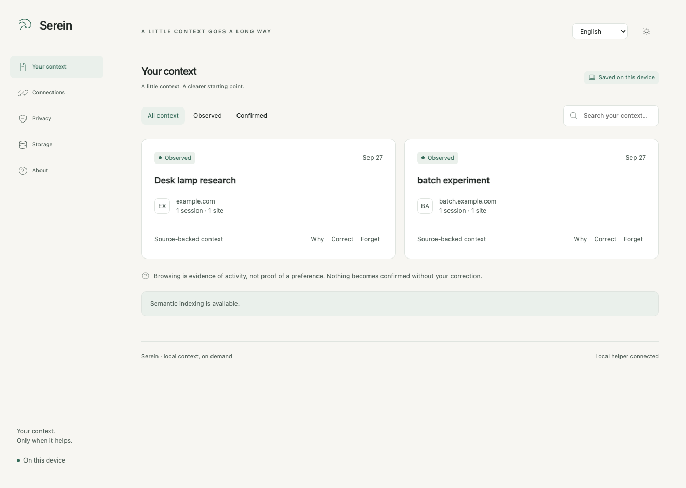

# Serein

Browser context for local AI assistants.

Serein saves the tab titles, sites, and searches you allow it to see. When a paired assistant needs to pick up where you left off, it can ask Serein for a short list of relevant observations and their sources. Capture starts only after you opt in. Serein does not read page content or import your browser history.

[Download](https://github.com/Maar10Herr/serein/releases/tag/v0.1.0-beta.3) · [Install guide](docs/INSTALL.md) · [Privacy](docs/PRIVACY.md) · [Test results](docs/TEST_REPORT.md)

## Install

The current download runs on **macOS with Apple silicon** and works with Chrome, Chromium, or Firefox. You need one browser extension and the native runtime.

1. Download the [Chrome/Chromium extension](https://github.com/Maar10Herr/serein/releases/download/v0.1.0-beta.3/serein-chrome-0.1.0-beta.3-unsigned.zip) or [Firefox extension](https://github.com/Maar10Herr/serein/releases/download/v0.1.0-beta.3/serein-firefox-0.1.0-beta.3-unsigned.zip), plus the [macOS runtime](https://github.com/Maar10Herr/serein/releases/download/v0.1.0-beta.3/serein-macos-arm64-0.1.0-beta.3-unsigned.tar.gz).
2. Extract both downloads. Load the extension: use **Load unpacked** in `chrome://extensions`, or **Load Temporary Add-on** in `about:debugging` and select `manifest.json`.
3. Open the extension's **Connections** page. Review the two consent choices, select your assistant, and choose whether to install the skill from GitHub. Click **Copy local helper setup instructions** and paste them into an assistant running on this Mac. Tell it where you extracted the runtime.
4. Return to Serein and click **Verify connection**.

The extension packages are unsigned. Firefox removes temporary add-ons when it restarts. The [install guide](docs/INSTALL.md) covers each step, manual setup, and skill installation. Other platforms can [build from source](docs/DEVELOPMENT.md).

## Your controls

You decide which sites can be saved and whether an assistant can recall them. Serein records foreground tab metadata, not page bodies: a title, hostname, recognized search term, and rough time in view. You can pause capture, use selected-sites mode, inspect saved evidence, correct a suggestion, or delete a site's data.

The browser and native helper work locally. A recall request returns a small packet to the paired assistant; that assistant may send it to its model provider. See [Privacy](docs/PRIVACY.md) for the exact boundary and [Security](docs/SECURITY.md) for the threat model.

## For developers

[Build and test Serein](docs/DEVELOPMENT.md) · [Read the test report](docs/TEST_REPORT.md)

Serein is licensed under [GPL-3.0-only](LICENSE). The bundled model and dependencies have [their own licenses](docs/THIRD_PARTY_LICENSES.json).
