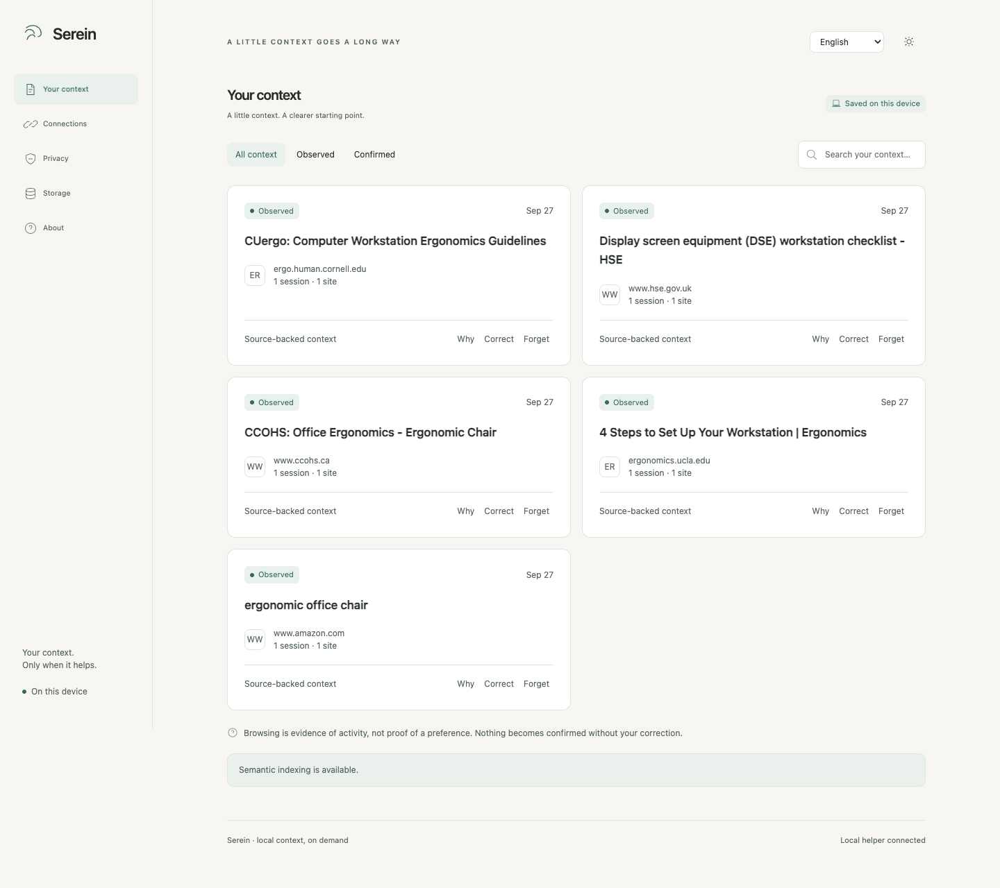

# Serein

## Your AI forgets what you researched. Serein doesn't.

**Research once. Pick up where you left off.**

Serein gives Codex, Claude Code, and other local AI assistants the research trail they missed. Ask about something you explored days ago, and your agent can bring back relevant saved pages and searches with sources.

**Saved locally · No page scraping · You choose what gets saved**

[Install Serein](docs/INSTALL.md) · [See the release](https://github.com/Maar10Herr/serein/releases/tag/v0.1.2) · [How it works](#how-it-works) · [Privacy](docs/PRIVACY.md)

Browse normally. Serein remembers the pages and searches you allow. When they matter later, your assistant can find them with sources. [See the dark theme](docs/screenshots/research-demo-dark.png).

## How it works

1. **Browse.** Save useful research signals as you go: page titles, sites, searches, and rough time in view.
2. **Ask.** Your paired assistant looks up relevant context when you need it. Try: “Which workstation guides was I comparing?”
3. **Stay in control.** Pause saving, limit it to selected sites, correct a result, or forget it.

## Install

The current release supports **macOS with Apple silicon**, using Chrome or Firefox.

1. **Install the extension.** Download the [Chrome ZIP](https://github.com/Maar10Herr/serein/releases/download/v0.1.2/serein-chrome-0.1.2-unsigned.zip) or [Firefox ZIP](https://github.com/Maar10Herr/serein/releases/download/v0.1.2/serein-firefox-0.1.2-unsigned.zip) and load it in your browser.
2. **Install the skill.** Ask your local assistant to install `serein-context` from `https://github.com/Maar10Herr/serein` using its skill installer. The skill includes the local helper, model, and reader.
3. **Link them.** Open **Connections** in the extension, review the capture and recall choices, and click **Copy link instruction**. Paste it into the local assistant where you installed the skill. Serein checks the connection automatically.

There is no separate runtime download or database path to enter. The [install guide](docs/INSTALL.md) has browser-specific steps and the Skills CLI command. The extension packages are unsigned; Firefox loads them as temporary add-ons that must be reloaded after a restart.

[See the first-run screen after linking](docs/screenshots/connected-first-run.png).

## Your controls

You decide which sites can be saved and whether an assistant can recall them. Collection starts only after you opt in. Serein does not read page bodies, import browser history, or run a background service.

The browser and helper work locally. A recall packet sent to a paired assistant may then reach that assistant's model provider. See [Privacy](docs/PRIVACY.md) and [Security](docs/SECURITY.md) for details.

## Development

[Build and test Serein](docs/DEVELOPMENT.md) · [Read the test report](docs/TEST_REPORT.md)

Serein is licensed under [GPL-3.0-only](LICENSE). Licenses for the model and dependencies are included with the skill.
