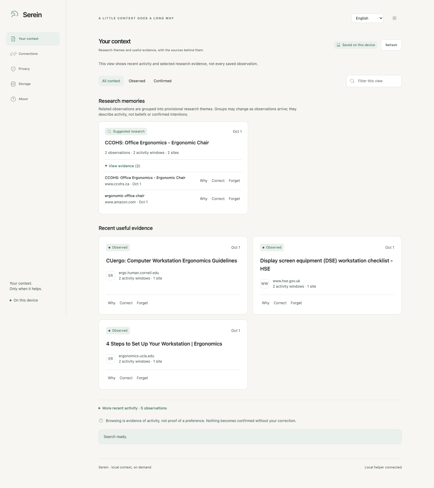

# Serein

## Your AI forgets what you researched. Serein doesn't.

Bring useful browser research back into a conversation with your local AI assistant, without uploading your browser history or running a background service. After you opt in, Serein saves limited tab metadata—permitted site names, page titles, recognized search terms, and coarse foreground time—in a local vault. When relevant, a paired assistant can request a small set of matching observations with their sources.

Serein does not read page bodies or import browser history. Collection can be paused or limited to selected sites, and saved observations can be corrected or forgotten. The browser extension and helper run locally; an assistant may send the returned context to its model provider when answering. See [Privacy](docs/PRIVACY.md) and [Security](docs/SECURITY.md).

[Install Serein v0.2.0](docs/INSTALL.md) · [Release v0.2.0](https://github.com/Maar10Herr/serein/releases/tag/v0.2.0) · [Release notes](.github/RELEASE_NOTES.md) · [How it works](#how-it-works) · [Privacy](docs/PRIVACY.md)

This v0.2.0 preview replays invented visits using public-site titles and hosts observed in an earlier test. It is not a live browsing capture or user history. [Dark theme](docs/screenshots/research-preview-dark.png) · [Earlier live public-site capture](docs/screenshots/research-demo-light.png) · [Preview method](docs/TEST_REPORT.md#v020-browser-preview)

## How it works

1. **Choose what to save.** Collection starts after consent. Serein records allowed metadata from browser tabs; it does not inspect page content.
2. **Ask when you need it.** A paired local assistant requests relevant saved observations for the current question. Each result retains its source details.
3. **Review and manage the record.** Pause collection, use selected-sites mode, correct an observation, or forget it from the dashboard.

## Install

Version **0.2.0** targets **macOS with Apple silicon**, using Chrome or Firefox.

1. Download the [Chrome ZIP](https://github.com/Maar10Herr/serein/releases/download/v0.2.0/serein-chrome-0.2.0-unsigned.zip) or [Firefox ZIP](https://github.com/Maar10Herr/serein/releases/download/v0.2.0/serein-firefox-0.2.0-unsigned.zip) and load the extracted extension in your browser.
2. Install the `serein-context` skill from [the Serein repository](https://github.com/Maar10Herr/serein) with your local assistant's skill installer. The [skill ZIP](https://github.com/Maar10Herr/serein/releases/download/v0.2.0/serein-skills-0.2.0.zip) is available for inspection or archive-based installers.
3. Open **Connections** in the extension, review the capture and recall choices, then select **Copy link instruction**. Paste it into the assistant where you installed the skill. Serein checks the connection automatically.

There is no separate runtime download or database path to enter. The [installation guide](docs/INSTALL.md) has browser-specific steps and the Codex Skills CLI command. The extension packages are unsigned; Firefox loads them as temporary add-ons that must be reloaded after a restart.

## Assistant integrations

The required integration targets are Claude Code, Codex, OpenCode, Hermes, OpenClaw, and a generic local executor. The shared skill package and setup path are documented in the [test report](docs/TEST_REPORT.md), which distinguishes installation evidence from execution inside each assistant.

## Retrieval

Ask about the research you saved, compare two products, or bring back a constraint you confirmed. Recall keeps sources and corrections visible and returns at most six records. The dashboard filters its displayed cards; assistant recall searches the eligible vault.

Two-model `Compare` questions and narrow `from X to Y` questions receive dedicated ordering checks. General negation and word order remain limitations. [Retrieval behavior](docs/RETRIEVAL.md) explains the supported forms and activity counts.

## Evaluation

Retrieval is checked with synthetic research episodes and fixed relevance labels. Existing fixtures are regression checks; the new 24-question set is authored separately before either build runs. These checks do not establish accuracy on real browsing histories. See the [test report](docs/TEST_REPORT.md) for methodology, scores, and remaining validation.

## Development

[Build and test Serein](docs/DEVELOPMENT.md) · [Read the test report](docs/TEST_REPORT.md)

Serein is licensed under [GPL-3.0-only](LICENSE). Licenses for the model and dependencies are included with the skill.
